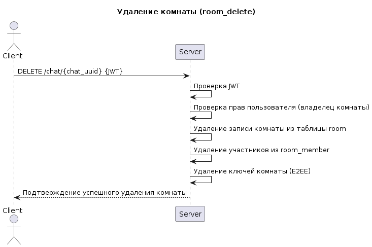

# bil-message

## Описание проекта

`bil-message` — это система защищённого обмена сообщениями между пользователями с поддержкой нескольких устройств на одного пользователя и энд-ту-энд шифрования (E2EE).  
Проект реализован по клиент-серверной архитектуре с использованием Go и PostgreSQL.

## Доступный функционал

1. Регистрация пользователя
2. Добавление устройства
3. Вход в аккаунт
4. Выход из аккаунта
5. Создание комнаты
6. Добавление пользователя в комнату
7. Удаление пользователя из комнаты
8. Общение в комнате (отправка и получение сообщений)

---

## Архитектура

### Серверная часть

Серверная часть реализована в Go и отвечает за:
- Аутентификацию и регистрацию пользователей.
- Управление устройствами: генерация и хранение публичных ключей каждого устройства пользователя.
- Создание комнат, управление членством и правами пользователей.
- Хранение зашифрованных ключей для каждого устройства (`room_keys`), используемых для расшифровки сообщений.
- Хранение сообщений в зашифрованном виде (`room_messages`), без доступа к расшифрованному контенту.
- Предоставление API для клиентских приложений (REST API с версией `/api/v1`).

Сервер поддерживает работу с несколькими устройствами на одного пользователя. Каждое устройство имеет уникальный идентификатор и публичный ключ. Сообщения шифруются на клиенте симметричным ключом для конкретного сообщения, а этот ключ затем шифруется публичными ключами всех устройств пользователя. Это позволяет каждому устройству безопасно расшифровать сообщение.

### Клиентская часть

Клиентская часть реализована в виде CLI-приложения:
- Позволяет регистрировать пользователя и входить в аккаунт.
- Позволяет добавлять новые устройства и синхронизировать ключи сообщений.
- Поддерживает создание комнат, добавление и удаление участников.
- Отправка и получение зашифрованных сообщений.
- Полностью совместим с E2EE: клиент шифрует сообщения симметричным ключом для конкретного сообщения, а расшифровка выполняется после получения с использованием приватного ключа устройства.

Клиент может запускаться на нескольких устройствах одновременно, синхронизируя ключи через сервер без раскрытия приватных ключей.

---

## База данных

## Регистрация

## Добавление устройтсва

## Вход в аккаунт

## Выход из аккаунта

## Создание чата

## Удаление чата

## Добавление пользователя в чат

## Удаление пользователя из чата

## Общение в чате

---

## Тестирование

Проект содержит E2E-тесты (end-to-end), которые проверяют основные сценарии работы системы через клиентское и серверное приложения.  
Тесты обеспечивают проверку функциональности на уровне всего стека: от регистрации пользователя до отправки сообщений в комнатах.

## Тестовые сценарии — Auth

### 1. Регистрация пользователя
- **Цель:** Проверить возможность регистрации нового пользователя через клиент.  
- **Шаги:**
  1. Клиент вызывает команду `register` с указанием имени пользователя и пароля.
  2. Сервер обрабатывает запрос и создаёт запись в базе данных.
- **Проверка:**
  - Пользователь успешно создан в базе данных.
  - Ошибки регистрации отсутствуют.

### 2. Добавление устройства
- **Цель:** Проверить регистрацию нового устройства для пользователя.  
- **Шаги:**
  1. Клиент вызывает команду `device` с указанием имени пользователя, пароля и публичного ключа устройства.
  2. Сервер регистрирует устройство и возвращает UUID.
- **Проверка:**
  - UUID устройства корректно сохраняется локально в `~/.config/bil_message_client_device_uuid`.
  - UUID не пустой.

### 3. Вход пользователя (Login)
- **Цель:** Проверить возможность входа пользователя с указанием устройства.  
- **Шаги:**
  1. Клиент вызывает команду `login` с именем пользователя, паролем и UUID устройства.
  2. Сервер возвращает JWT токен.
- **Проверка:**
  - JWT токен получен и не пустой.
  - Токен соответствует указанному устройству.

---

## Тестовые сценарии — Chat

### 1. Создание чата
- **Цель:** Проверить возможность создания новой комнаты.  
- **Шаги:**
  1. Пользователь с действительным токеном вызывает команду `create`.
  2. Сервер создаёт новую комнату и возвращает `chatUUID`.
- **Проверка:**
  - `chatUUID` уникален и не пустой.

### 2. Добавление участника в чат
- **Цель:** Проверить возможность добавления другого пользователя в комнату.  
- **Шаги:**
  1. Владелец комнаты вызывает команду `add-member` с указанием `chatUUID` и `member-uuid`.
  2. Сервер добавляет пользователя в комнату.
- **Проверка:**
  - Пользователь успешно добавлен в комнату.
  - Сервер возвращает успешный статус.

### 3. Удаление участника из чата
- **Цель:** Проверить удаление пользователя из комнаты.  
- **Шаги:**
  1. Владелец комнаты вызывает команду `remove-member` с указанием `chatUUID` и `member-uuid`.
  2. Сервер удаляет пользователя из комнаты.
- **Проверка:**
  - Пользователь больше не является участником комнаты.
  - Сервер возвращает успешный статус.

### 4. Удаление чата
- **Цель:** Проверить возможность удаления комнаты полностью.  
- **Шаги:**
  1. Владелец комнаты вызывает команду `remove` с указанием `chatUUID`.
  2. Сервер удаляет комнату и связанные данные.
- **Проверка:**
  - Комната удалена.
  - Связанные данные (участники, сообщения) удалены.

## Тестовые сценарии — Общение в чате (WebSocket)

### 1. Подключение к WebSocket
- **Цель:** Проверить возможность подключения клиента к комнате по WebSocket.  
- **Шаги:**
  1. Пользователь вызывает команду `ws` с параметрами `--address`, `--token`, `--room-uuid`.
  2. Клиент устанавливает соединение с сервером.
- **Проверка:**
  - Соединение установлено успешно.
  - Сервер подтверждает авторизацию (валидный токен).

### 2. Отправка сообщения
- **Цель:** Проверить отправку сообщения в чат через WebSocket.  
- **Шаги:**
  1. Подключённый клиент вводит текст сообщения.
  2. Сообщение отправляется на сервер.
- **Проверка:**
  - Сервер получает сообщение.
  - Сообщение сохраняется в истории чата.
  - Отправитель получает подтверждение доставки.

### 3. Получение сообщений другим участником
- **Цель:** Проверить получение сообщений всеми участниками комнаты.  
- **Шаги:**
  1. Второй пользователь подключается к той же комнате через команду `ws`.
  2. Первый пользователь отправляет сообщение.
  3. Второй пользователь получает сообщение в реальном времени.
- **Проверка:**
  - Сообщение доставлено всем активным участникам комнаты.
  - Содержимое сообщения совпадает с отправленным текстом.

### 4. Синхронизация истории при подключении
- **Цель:** Проверить, что новый участник получает историю сообщений.  
- **Шаги:**
  1. В комнате уже есть несколько сообщений.
  2. Новый пользователь подключается через команду `ws`.
- **Проверка:**
  - При подключении пользователь получает последние сообщения из истории чата.
  - Сообщения отображаются в корректном порядке (по времени).

### 5. Закрытие соединения
- **Цель:** Проверить корректное завершение WebSocket-сессии.  
- **Шаги:**
  1. Пользователь отключается от чата (`Ctrl+C` или закрытие клиента).
  2. Сервер закрывает соединение.
- **Проверка:**
  - Соединение закрыто без ошибок.
  - Пользователь может снова подключиться к комнате.

### Реализация тестов

- Тесты используют **Testcontainers** для поднятия PostgreSQL в контейнере, чтобы создать изолированную базу данных для каждого запуска.
- Для серверной и клиентской части компилируются бинарники на лету.
- Тесты выполняются через CLI клиента, имитируя реальные пользовательские сценарии.
- Для каждого теста генерируется уникальный пользователь, что исключает конфликты при повторном запуске.

## Серверный бинарник

Серверная часть доступна в виде готового бинарника для Linux (amd64):

| Платформа     | Путь к бинарнику                                   |
|--------------|---------------------------------------------------|
| Linux (amd64) | `builds/server/bil-message-server-linux-amd64`  |

## Клиентские бинарники

Клиентская часть доступна в виде готовых бинарников для основных платформ:

| Платформа       | Путь к бинарнику                                      |
|-----------------|------------------------------------------------------|
| Linux (amd64)   | `builds/clients/bil-message-client-linux-amd64`     |
| MacOS (amd64)   | `builds/clients/bil-message-client-macos-amd64`     |
| Windows (amd64) | `builds/clients/bil-message-client-windows-amd64.exe` |

## Установка CLI клиента `bil-message-client`

| Шаг | Команда | Описание |
|-----|---------|----------|
| 1   | `cp builds/clients/bil-message-client-linux-amd64 $HOME/.local/bin/bil-message-client` | Копирование бинарника для Linux в директорию локальных бинарников (замените на соответствующий для вашей ОС) |
| 2   | `chmod +x $HOME/.local/bin/bil-message-client` | Сделать бинарник исполняемым (только Linux/MacOS) |
| 3   | `echo 'export PATH=$HOME/.local/bin:$PATH' >> ~/.bashrc`   `source ~/.bashrc` | Добавление директории с бинарником в PATH, чтобы запускать клиента из любого места (для Zsh используйте `~/.zshrc`) |
| 4   | `bil-message-client version` | Проверка установки, вывод версии клиента, хэша коммита и даты сборки |

